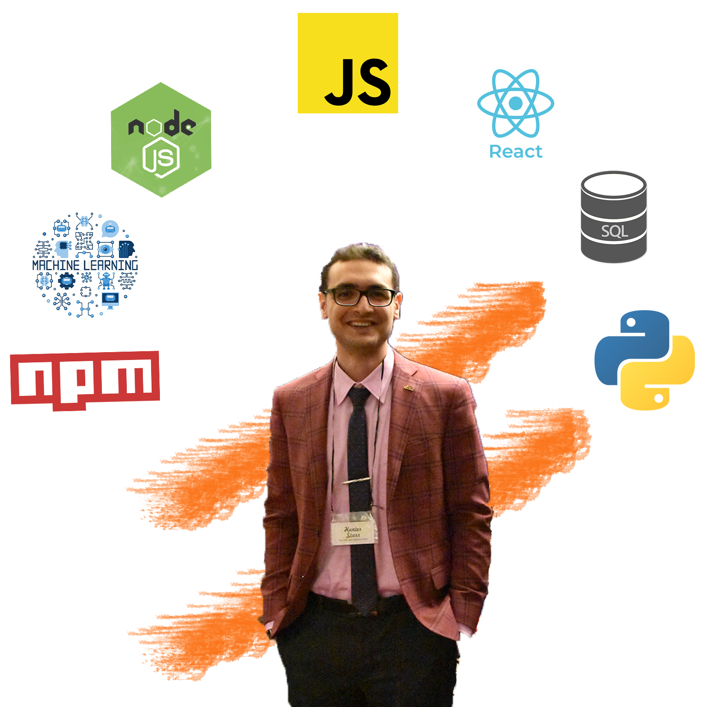

<p align="center">
  
</p>


### I'm [Ali](https://Alizmn.github.io)!
<p>Welcome to my GitHub profile, I hope you enjoy it ❤️</p>

  
  
    
<br></br>
###  A little more about me...  
```javascript
const Ali = {
  pronouns: "he" | "his",
  code: [Javascript, HTML, CSS, Python],
  tools: [React, Node, Storybook, Styled-Components, Jest, Vagrant],
  architecture: ["microservices", "event-driven", "design system pattern"],
  Learning: [
                        React Native,
                        Typeccript,
                        Docker
              ],
 challenge: "I am doing the AppFromHome challenge focused on react and react native"
}
```

 <em><b>I love connecting with different people</b> so if you want to say <b>hi, I'll be happy to meet you more!</b> :)</em>

---


<!--
**Alizmn/Alizmn** is a ✨ _special_ ✨ repository because its `README.md` (this file) appears on your GitHub profile.

Here are some ideas to get you started:

- 🔭 I’m currently working on ...
- 🌱 I’m currently learning ...
- 👯 I’m looking to collaborate on ...
- 🤔 I’m looking for help with ...
- 💬 Ask me about ...
- 📫 How to reach me: ...
- 😄 Pronouns: ...
- ⚡ Fun fact: ...
-->
